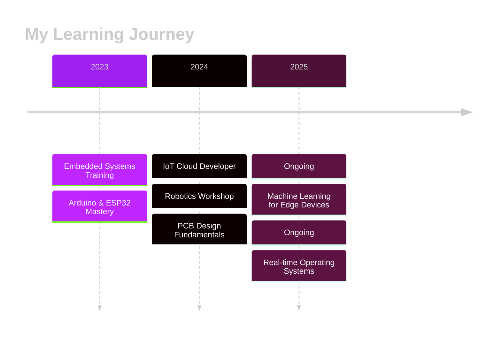

<div align="center">

<!-- Animated Circuit Background Banner -->


<!-- Typing Animation Header -->
<a href="https://git.io/typing-svg"></a>

<!-- Animated IoT Rotating Icon -->


</div>

<!-- Glowing Divider -->


##  About Me


🧩 **I'm an Embedded Systems & IoT Developer** who loves connecting code with hardware. From building smart devices to exploring AI-powered sensors, I enjoy crafting solutions that bring the digital and physical worlds together.

🎓 **Education:**
- 🎓 **Diploma** in Computer Science & Engineering *(Completed)*
- 🎓 **Pursuing B.Tech** in Electronics & Communication Engineering

⚡ **What I Do:**
- 🔧 Design & develop embedded systems and IoT solutions
- 📡 Build smart devices that communicate seamlessly
- 🤖 Explore robotics and AI on edge devices
- 💻 Write firmware that powers intelligent hardware
- 🧠 Innovate at the intersection of hardware and software

🌟 **Interests:**
- Embedded Systems | IoT | Robotics | AI on Edge Devices
- Firmware Development | PCB Design | Smart Sensors
- Industrial Automation | Real-time Systems

<br clear="right"/>

<!-- Glowing Divider -->


##  Skills & Tech Stack

<div align="center">

### 💻 Programming Languages


### ⚙️ Embedded Tools & IDEs


### 🔌 Hardware Platforms


### 📡 IoT Protocols & Communication


### ☁️ IoT Cloud Platforms


### 🛠️ Other Tools


</div>

<!-- Glowing Divider -->


##  Featured Projects

<div align="center">

<table>
<tr>
<td width="50%">

### 🌡️ **Smart Home IoT System**


**What it does:**  
A complete home automation system enabling remote control and monitoring of household devices through a mobile app. Features include temperature/humidity sensing, smart lighting control, voice assistant integration (Google Home), and real-time notifications.

**Tech Stack:**
- 🔧 **Hardware:** ESP32, DHT22 sensors, Relay modules, PIR motion sensors
- 📡 **Communication:** WiFi, MQTT protocol
- ☁️ **Cloud:** Firebase Realtime Database, Blynk IoT platform
- 💻 **Firmware:** C++ with Arduino framework, FreeRTOS for multitasking

🔗 **[View Repository](https://github.com/amit-kumar84/smart-home-iot)** | **[Live Demo](https://github.com/amit-kumar84/smart-home-iot#demo)**


</td>
<td width="50%">

### 🚗 **Vehicle Tracking System with Geofencing**


**What it does:**  
Real-time vehicle tracking system with GPS integration, displaying live location on Google Maps. Includes geofencing alerts (SMS/Email notifications when vehicle enters/exits predefined zones), speed monitoring, and route history logging.

**Tech Stack:**
- 🔧 **Hardware:** ESP32, NEO-6M GPS module, GSM SIM800L module
- 📡 **Communication:** GSM/GPRS, HTTP REST API
- 🗺️ **Mapping:** Google Maps API, Leaflet.js for web dashboard
- 💻 **Backend:** Python Flask API, MongoDB for location data storage

🔗 **[View Repository](https://github.com/amit-kumar84/vehicle-tracker-esp32)** | **[Documentation](https://github.com/amit-kumar84/vehicle-tracker-esp32/wiki)**

</td>
</tr>
<tr>
<td width="50%">

### ⚙️ Industrial Automation with MQTT


🏭 Industrial monitoring system:
- Sensor data collection
- MQTT protocol communication
- Dashboard visualization
- Alert management

</td>
<td width="50%">

### 💡 Smart Lighting System


💡 Intelligent lighting control:
- Motion sensor integration
- Ambient light detection
- Energy monitoring
- Scheduled automation

</td>
</tr>
</table>

</div>

<!-- Glowing Divider -->


##  GitHub Stats & Analytics

<div align="center">

<!-- GitHub Stats Card -->


<!-- GitHub Streak Stats -->


<!-- Top Languages -->


<!-- Activity Graph -->


<!-- Contribution Snake Animation -->


<!-- Trophy Stats -->


</div>

<!-- Glowing Divider -->


##  Achievements & Certifications

<div align="center">



| 🎓 Certification | 🏛️ Institution/Platform | 📅 Status |
|---|---|---|
| 🔧 Embedded Systems Development | Technical Institute | ✅ Completed |
| ☁️ IoT Cloud Architecture | Online Platform | 📚 In Progress |
| 🤖 Robotics & Automation | Workshop Series | ✅ Completed |
| 🧠 Machine Learning for Edge Devices | Coursera | 📚 Currently Learning |
| ⚙️ Real-time Operating Systems (RTOS) | Self-Learning | 📚 Currently Learning |
| 🔒 IoT Security Fundamentals | Future Goal | 🎯 Planned |

</div>

<!-- Glowing Divider -->


##  Connect With Me

<div align="center">

### 🌐 Let's Build Something Amazing Together!

[](https://linkedin.com/in/example)
[](https://twitter.com/example)
[](https://instagram.com/example)
[](https://facebook.com/example)
[](https://wa.me/8126704800)
[](https://github.com/amit-kumar84)
[](mailto:kumaramit812670@gmail.com)
[](https://github.com/amit-kumar84)

<br>

<!-- Visitor Counter -->


<!-- Profile Views Counter -->


</div>

<!-- Glowing Divider -->


##  Fun Facts & Current Focus

<div align="center">


### 🧭 Currently Learning
- 🔒 **IoT Security** & Cybersecurity for embedded systems
- 🤖 **Machine Learning on Edge Devices** (TinyML)
- ⚙️ **Real-time Operating Systems** (FreeRTOS)
- 🧠 **AI-powered Sensor Fusion**

### 🎯 2025 Goals
- ✨ Contribute to open-source IoT projects
- 🚀 Build an AI-powered smart city solution
- 📚 Master advanced PCB design
- 🌟 Share knowledge through tech blogs

### ⚡ Fun Facts
- 🕹️ I can debug hardware faster than I can fix typos!
- 🌙 Night owl coder - best ideas come at 2 AM
- ☕ Coffee-driven developer ☕
- 🎵 Code better with lo-fi music

### 🕒 Current Time in India


</div>

<!-- Glowing Divider -->


##  Support My Work

<div align="center">

If you find my projects helpful or interesting, consider giving them a ⭐!

```text
 ██████╗ ██████╗ ██████╗ ███████╗    ██╗    ██╗██╗████████╗██╗  ██╗
██╔════╝██╔═══██╗██╔══██╗██╔════╝    ██║    ██║██║╚══██╔══╝██║  ██╗
██║     ██║   ██║██║  ██║█████╗      ██║ █╗ ██║██║   ██║   ███████║
██║     ██║   ██║██║  ██║██╔══╝      ██║███╗██║██║   ██║   ██╔══██║
╚██████╗╚██████╔╝██████╔╝███████╗    ╚███╔███╔╝██║   ██║   ██║  ██║
 ╚═════╝ ╚═════╝ ╚═════╝ ╚══════╝     ╚══╝╚══╝ ╚═╝   ╚═╝   ╚═╝  ╚═╝
                                                                      
 ██████╗██╗██████╗  ██████╗██╗   ██╗██╗████████╗███████╗           
██╔════╝██║██╔══██╗██╔════╝██║   ██║██║╚══██╔══╝██╔════╝           
██║     ██║██████╔╝██║     ██║   ██║██║   ██║   ███████╗           
██║     ██║██╔══██╗██║     ██║   ██║██║   ██║   ╚════██║           
╚██████╗██║██║  ██║╚██████╗╚██████╔╝██║   ██║   ███████║           
 ╚═════╝╚═╝╚═╝  ╚═╝ ╚═════╝ ╚═════╝ ╚═╝   ╚═╝   ╚══════╝           
```

**"Your star is my motivation to keep innovating!"** ⭐

</div>

<!-- Glowing Divider -->


##  Quote of the Day

<div align="center">


</div>

<!-- Glowing Divider -->


<!-- Footer -->
<div align="center">

###  "Turning Circuits into Smart Life | Innovating the IoT World" 


<!-- Neon Glow Signature Line -->
<p>

</p>

**Made with**  **and**   **by Amit Kumar**


</div>

<!-- GitHub Snake Eating Contribution Graph -->
<!-- To enable snake animation:
1. Go to your profile repository (amit-kumar84/amit-kumar84)
2. Create a folder: .github/workflows
3. Create a file: snake.yml with the workflow configuration
-->

<!-- Hidden ASCII Art Easter Egg -->
<!--
    ⠀⠀⠀⠀⠀⠀⠀⠀⣀⣤⣴⣶⣶⣶⣶⣶⣶⣶⣦⣤⣀⠀⠀⠀⠀⠀⠀⠀⠀⠀
    ⠀⠀⠀⠀⠀⣠⣴⣾⣿⣿⣿⣿⣿⣿⣿⣿⣿⣿⣿⣿⣿⣷⣦⣄⠀⠀⠀⠀⠀⠀
    ⠀⠀⠀⣠⣾⣿⣿⣿⣿⣿⣿⣿⣿⣿⣿⣿⣿⣿⣿⣿⣿⣿⣿⣿⣷⣄⠀⠀⠀⠀
    ⠀⠀⣴⣿⣿⣿⣿⣿⣿⣿⣿⣿⣿⣿⣿⣿⣿⣿⣿⣿⣿⣿⣿⣿⣿⣿⣦⠀⠀⠀
    ⠀⣼⣿⣿⣿⣿⣿⣿⣿⠿⠿⠿⠿⠿⠿⠿⠿⠿⠿⢿⣿⣿⣿⣿⣿⣿⣿⣧⠀⠀
    ⢰⣿⣿⣿⣿⣿⡿⠋⠀⠀⠀⠀⠀⠀⠀⠀⠀⠀⠀⠀⠀⠙⢿⣿⣿⣿⣿⣿⡆⠀
    ⢸⣿⣿⣿⣿⡟⠀⠀⠀IoT Developer⠀⠀⠀⢻⣿⣿⣿⣿⡇⠀
    ⢸⣿⣿⣿⣿⡇⠀⠀⠀⠀⠀⠀⠀⠀⠀⠀⠀⠀⠀⠀⠀⠀⢸⣿⣿⣿⣿⡇⠀
    ⠘⣿⣿⣿⣿⣿⣦⡀⠀⠀⠀⠀⠀⠀⠀⠀⠀⠀⠀⠀⢀⣴⣿⣿⣿⣿⣿⠃⠀
    ⠀⠹⣿⣿⣿⣿⣿⣿⣷⣦⣤⣀⣀⣀⣀⣀⣀⣤⣴⣾⣿⣿⣿⣿⣿⣿⠏⠀⠀
    ⠀⠀⠈⠻⣿⣿⣿⣿⣿⣿⣿⣿⣿⣿⣿⣿⣿⣿⣿⣿⣿⣿⣿⣿⠟⠁⠀⠀⠀
    ⠀⠀⠀⠀⠈⠛⢿⣿⣿⣿⣿⣿⣿⣿⣿⣿⣿⣿⣿⣿⣿⡿⠛⠁⠀⠀⠀⠀⠀
    ⠀⠀⠀⠀⠀⠀⠀⠈⠙⠛⠿⠿⣿⣿⣿⣿⠿⠿⠛⠋⠁⠀⠀⠀⠀⠀⠀⠀⠀
    
    Thanks for visiting! Hope you found something interesting! 🚀
-->
